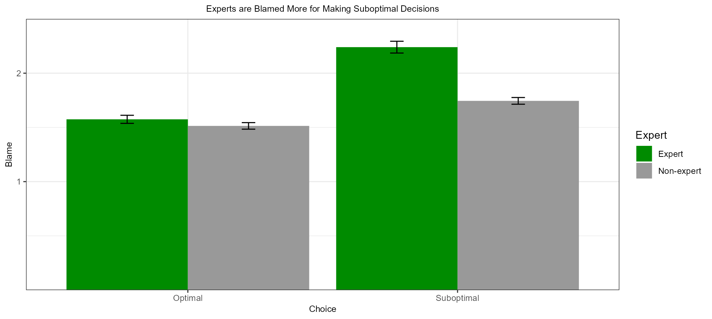

```{r setup, include = FALSE}
library("papaja")
r_refs("r-references.bib")
library("ggplot2")
library("tidyverse")
```

```{r analysis-preferences}
# Seed for random number generation
set.seed(42)
knitr::opts_chunk$set(cache.extra = knitr::rand_seed)
```

```{r read-in-data, include = FALSE}
setwd("C:/Users/samha/Documents/GitHub/Optimality-Bias/1-19_pre_class")
optdata <- read.csv("1-19_pre_class_CLEANED DATASHEET.csv") %>% select(-1)
```

```{r clean-for-plot1-1, include = FALSE}
for (i in 1:9) {
  optdata[,i] <- sapply(optdata[,i], as.numeric)
}
for (i in 10:11) {
  optdata[,i] <- sapply(optdata[,i], as.character)
}

##FOR PLOT 1
optdata_rev <- subset(optdata, both_pkc<=6.5)
optdata_rev <- subset(optdata, both_exp>2.5)
optdata_rev <- rename(optdata_rev, Expert=expert)
knitr::opts_chunk$set(warning = FALSE, message = FALSE) 
```

```{r clean-for-plot1-2, include = FALSE}
optdata$choice = factor(optdata$choice, labels = c("Optimal", "Suboptimal"))
optdata$expert = factor(optdata$expert, labels = c("Expert", "Non-expert"))
summary <- optdata %>% 
  group_by(choice, expert) %>% 
  summarise(average_blame = mean(both_blc, na.rm = T),
            blame_sd = sd(both_blc, na.rm = T)/sqrt(nrow(optdata)), 
            blame_min = average_blame - blame_sd,
            blame_max = average_blame + blame_sd)

nicelimits <- function(x) {
  # x is the range of the data
  # get breaks under default breaks behaviour (breaks are not known in advance)
  breaks <- scales::extended_breaks()(x)
  # Take the difference between breaks (should be constant)
  width  <- diff(breaks)[1]
  # Do something like `floor()`, but with `width`-units
  start <- (x[1] %/% width) * width
  # Do something like `ceiling()`, but with `width`-units
  end <- (c(x[2] %/% width) + 1) * width
  c(start, end)
}
knitr::opts_chunk$set(warning = FALSE, message = FALSE) 
```

(ref:fig-fig1-caption) Mean ratings, based on choice, differ between experts and non-experts.

```{r fig-plot-1, fig.cap = "(ref:fig-fig1-caption)"}
p <- ggplot(optdata, aes(choice, both_blc, fill=as.factor(expert))) +
  geom_bar(stat="summary", position=position_dodge(.9)) + 
  scale_y_continuous(breaks=c(1:7), labels=c("1","2","3","4","5","6","7"), limits = nicelimits, expand=c(0,0)) +
  xlab("Choice") +
  ylab("Blame") +
  guides(fill=guide_legend(title="Expert")) +
  theme_bw() +
  theme(axis.title.x=element_text(size=9), axis.title.y=element_text(size=9)) +
  ggtitle("Experts are Blamed More for Making Suboptimal Decisions") +
  scale_fill_manual(values=c("green4", "gray60")) +
  theme(plot.title = element_text(hjust = 0.5, size=9)) +
  geom_errorbar(data = summary, aes(x = choice, 
                                        y = average_blame,
                                        ymin = blame_min+(blame_max-blame_min), 
                                        max = blame_max-(blame_max-blame_min)),
                color = "black", size = .5, width = .1, position=position_dodge(0.9))
p
ggsave(plot=p, filename = "blamebarchart.png", device = "png", width = 10, dpi=200, units = "in")
knitr::opts_chunk$set(warning = FALSE, message = FALSE) 
```

```{r table-table1, echo=FALSE}
mytable <- optdata %>%
  group_by(choice, expert) %>%
  summarize(
    M_blame = mean(both_blc, na.rm=TRUE),
    SD_blame = sd(both_blc, na.rm=TRUE),
    n.models = n()
  )

apa_table(mytable, caption = "Mean and SD of Blame")
knitr::opts_chunk$set(warning = FALSE, message = FALSE) 
```

(ref:fig-resbar-caption) This is a smaller bar chart.

```{r fig-resolutebar, fig.cap = "(ref:fig-resbar-caption)"}

```

# Introduction
This is the introduction^[It would also be desirable to test whether improved measures of negligence mediate the optimality bias, not merely whether they moderate the bias. De Freitas and Johnson (2018) tested moderation only.]

# Methods
We report how we determined our sample size, all data exclusions (if any), all manipulations, and all measures in the study. <!-- 21-word solution (Simmons, Nelson & Simonsohn, 2012; retrieved from http://ssrn.com/abstract=2160588) -->

## Participants

## Material

## Procedure

[^1]: 

## Data analysis
We used `r cite_r("r-references.bib")` for all our analyses.


# Results
These are the bar chart results (Figure\ \@ref(fig:fig-plot-1)). This is the bar chart but smaller (Figure\ \@ref(fig:fig-resolutebar)). This is the table with blame means and standard deviations (Table\ \@ref(tab:table-table1)).

# Discussion


\newpage

# References

::: {#refs custom-style="Bibliography"}
:::
